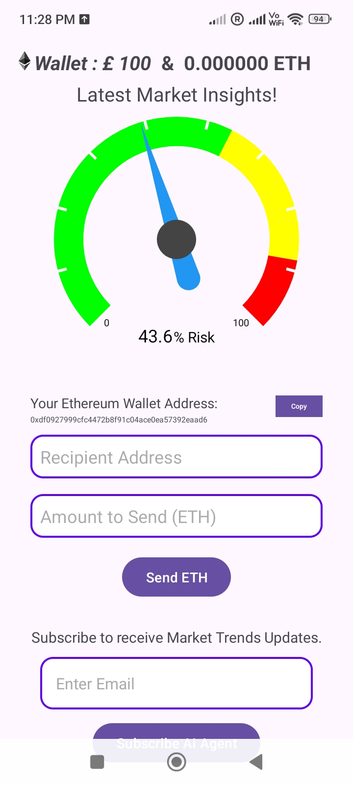
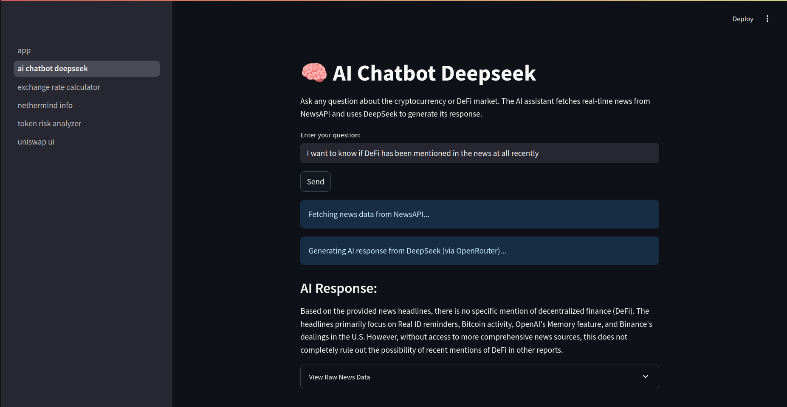
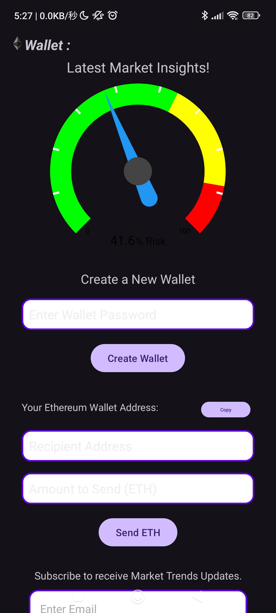

📉 ArgusFi App

ArgusFi App is a Streamlit-powered web application with a mobile app to provide users with real-time notifications about potential risks in the cryptocurrency market. Whether it's sudden market volatility, security breaches, or regulatory changes, this tool aims to keep you informed and ahead of potential threats.

🚀 Features

    Real-Time Risk Monitoring: Continuously analyzes market data to identify potential risks.

    Mobile Notifications: Sends instant alerts to your mobile device, ensuring you're always informed.

    User-Friendly Interface: Built with Streamlit for an intuitive and interactive user experience.

    Customizable Alerts: Allows users to set their own risk thresholds and notification preferences.

🌐 Web location

The web-app is available running live at the link: [https://argusfi.streamlit.app/](https://argusfi.streamlit.app/)

🛠️ Installation
Prerequisites

    Python 3.7 or higher

    pip (Python package installer)

Steps

    Clone the Repository:

git clone https://github.com/JasmineSJYThompson/encode-ai-hackerthon

cd encode-ai-hackerthon

Install Dependencies:

pip install -r requirements.txt

Run the Application:

    streamlit run app.py
        
📱 Mobile App Integration

The Android app can be downloaded from the link --> https://encodehackerthon45.s3.eu-north-1.amazonaws.com/AiAgent.apk

The mobile app complements the web application by providing:

1. The mobile app is based on Web3 and includes an Ethereum Wallet, allowing users to create their own wallet and send crypto with a single click.
2. It features an integrated indicator to show the current market risk, powered by ArgusFi (Team Dashboard).
3. Users can receive alerts via mobile notifications about market trends.
4. The app has the potential to advise fund managers once they create an ETH Wallet and start making transactions on platforms like eToro or Coinbase. Their transaction history can be tracked by the AiAgent App to optimize yield and portfolio performance.
"

🧠 How It Works

    Data Collection: The application fetches real-time data from various cryptocurrency exchanges and news sources.

    Risk Analysis: Implements algorithms to assess potential risks

    Alert Generation: When a potential risk is identified, the system generates an alert notification

    Notification Delivery: The alert is sent to the user's mobile device through the integrated mobile app.

🖥️ Technologies used for Web App

- Streamlit (web interface), AI chatbot uses OpenAI, Deepseek, NewsAPI and OpenRouter, Token Risk Analyser and Exchange Rate Calculator use CoinGeckoApi, Nethermind Info uses Nethermind and Starknet

App Display

Contributors

- JasmineSJYThompson Jasmine Thompson

- CHANCHIPUI Chi Pui (Martin) Chan

- MorganZhang44 Morgan Zhang

- Kamil2916 Kamil Amin

- recentlyhatched Georgina
